# Documentacao de Casos de Uso - MVP L&J Doces

## Metadados
- Projeto: **L&J Doces**
- Tipo: Documento de escopo e casos de uso do MVP
- Versao do documento: `1.1.3`
- Ultima atualizacao: `2026-05-13`

## Objetivo

Consolidar os casos de uso essenciais do MVP, cobrindo jornada do cliente, operacao administrativa, autenticacao, pedidos, sincronizacao em tempo real e suporte por IA.

## Atores

- Cliente: consulta catalogo, favoritos, checkout e historico de pedidos.
- Administrador/Proprietario: opera catalogo, estoque, banners, pedidos e analytics.
- Sistema: executa validacoes, sincronizacao offline/online e regras de negocio.
- IA: apoia recomendacao de producao com base em historico.

## Matriz de Rastreabilidade do MVP

| Caso de Uso | Ator Principal | RF Relacionado | RN Relacionada | RNF Relacionada |
|---|---|---|---|---|
| UC01 - Consultar catalogo em tempo real | Cliente | RF-03 | RN-01 | RNF-02, RNF-03, RNF-11 |
| UC02 - Autenticar e recuperar acesso | Cliente | RF-11, RF-12 | RN-10, RN-16 | RNF-09, RNF-10, RNF-14, RNF-15 |
| UC03 - Gerenciar perfil e favoritos | Cliente | RF-13, RF-15 | RN-10 | RNF-09, RNF-10 |
| UC04 - Gerenciar catalogo e categorias | Administrador/Proprietario | RF-01, RF-02, RF-14 | RN-03, RN-09, RN-13 | RNF-07, RNF-13 |
| UC05 - Controlar estoque e alertas | Administrador/Proprietario | RF-04, RF-05 | RN-02, RN-05 | RNF-03, RNF-11 |
| UC06 - Registrar vendas e penduricalhos | Administrador/Proprietario | RF-06, RF-07 | RN-04, RN-05 | RNF-03, RNF-06 |
| UC07 - Checkout e pedidos | Cliente | RF-17, RF-18 | RN-10, RN-11, RN-14, RN-15 | RNF-10, RNF-11, RNF-12 |
| UC08 - Operar offline e sincronizar | Sistema | RF-09, RF-20 | RN-07, RN-15 | RNF-05, RNF-11, RNF-12 |
| UC09 - Administrar banners e destaques | Administrador/Proprietario | RF-16 | RN-09, RN-12 | RNF-06, RNF-10 |
| UC10 - Consultar resumo e analytics | Administrador/Proprietario | RF-08, RF-19 | RN-09 | RNF-10, RNF-16 |
| UC11 - Receber atualizacoes por websocket | Sistema | RF-20 | RN-15 | RNF-11, RNF-12 |
| UC12 - Receber sugestao de producao por IA | IA/Administrador | RF-10 | RN-08 | RNF-08, RNF-16 |

## Descricao dos Casos de Uso

### UC01 - Consultar catalogo em tempo real
- Objetivo: permitir visualizacao de produtos, preco e disponibilidade atualizada.
- Fluxo principal: abrir app, carregar catalogo, exibir disponibilidade e destaque.
- Regra critica: produto sem estoque deve ser marcado como indisponivel.
- No diagrama: aparece dentro da jornada do cliente e esta ligado diretamente ao ator Cliente, representando o primeiro contato do usuario com a plataforma para consultar produtos disponiveis em tempo real.

Codigo do diagrama: [UC01.puml](./UC_Codes/UC01.puml)

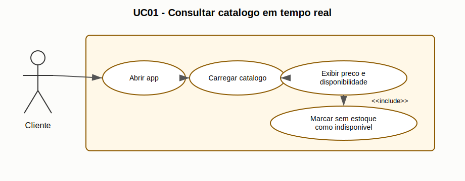

### UC02 - Autenticar e recuperar acesso
- Objetivo: permitir cadastro, login por email/senha, login Google e recuperacao de acesso.
- Fluxo principal: autenticar, manter sessao e, quando necessario, iniciar fluxo de reset.
- Regra critica: deep link de reset deve abrir tela correta no app.
- No diagrama: aparece dentro da jornada do cliente e esta ligado diretamente ao ator Cliente, indicando que a autenticacao e a recuperacao de acesso fazem parte da entrada segura do usuario no aplicativo.

Codigo do diagrama: [UC02.puml](./UC_Codes/UC02.puml)

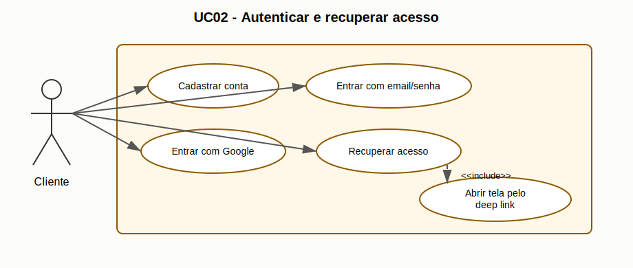

### UC03 - Gerenciar perfil e favoritos
- Objetivo: permitir atualizacao de perfil e gestao de produtos favoritos.
- Fluxo principal: usuario autenticado acessa perfil, salva alteracoes e marca/desmarca favoritos.
- Regra critica: operacoes exigem sessao valida.
- No diagrama: aparece dentro da jornada do cliente, ligado ao ator Cliente, e inclui a regra compartilhada Validar Sessao porque somente usuarios autenticados podem alterar perfil ou favoritos.

Codigo do diagrama: [UC03.puml](./UC_Codes/UC03.puml)

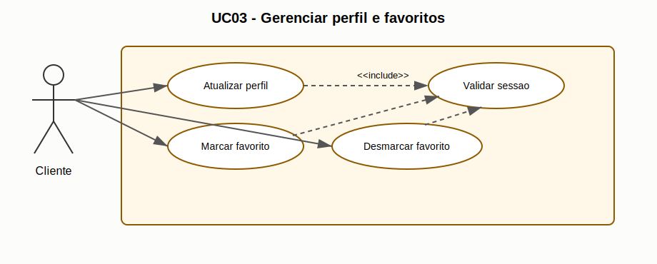

### UC04 - Gerenciar catalogo e categorias
- Objetivo: manter produtos, categorias e subcategorias organizados para exibicao no app.
- Fluxo principal: criar/editar/inativar produto, manter categorias e ordenacao.
- Regra critica: apenas perfil autorizado pode operar funcoes administrativas.
- No diagrama: aparece dentro da jornada administrativa, ligado ao ator Administrador, e inclui Validar Sessao para reforcar que a manutencao do catalogo depende de acesso administrativo autenticado.

Codigo do diagrama: [UC04.puml](./UC_Codes/UC04.puml)

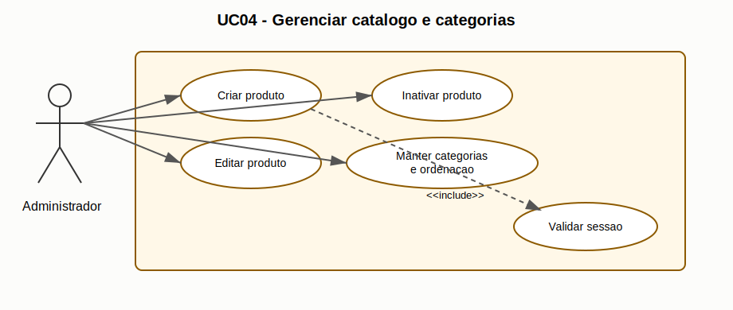

### UC05 - Controlar estoque e alertas
- Objetivo: registrar entradas/saidas e detectar nivel critico de itens.
- Fluxo principal: atualizar quantidade, recalcular saldo e emitir alerta de minimo.
- Regra critica: venda confirmada deve baixar estoque automaticamente.
- No diagrama: aparece dentro da jornada administrativa, ligado ao ator Administrador, e inclui Validar Estoque para mostrar que toda movimentacao precisa manter saldos e disponibilidade consistentes.

Codigo do diagrama: [UC05.puml](./UC_Codes/UC05.puml)

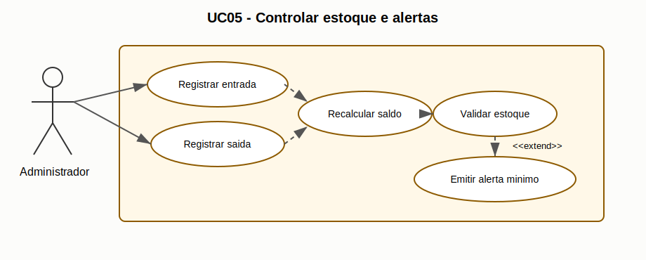

### UC06 - Registrar vendas e penduricalhos
- Objetivo: registrar venda imediata e venda a prazo com rastreabilidade.
- Fluxo principal: selecionar itens, validar disponibilidade, finalizar e registrar forma de pagamento.
- Regra critica: penduricalho exige identificacao do cliente.
- No diagrama: aparece dentro da jornada administrativa e esta ligado ao ator Administrador, representando a venda feita pela operacao interna, inclusive casos de venda a prazo registrados como penduricalhos.

Codigo do diagrama: [UC06.puml](./UC_Codes/UC06.puml)

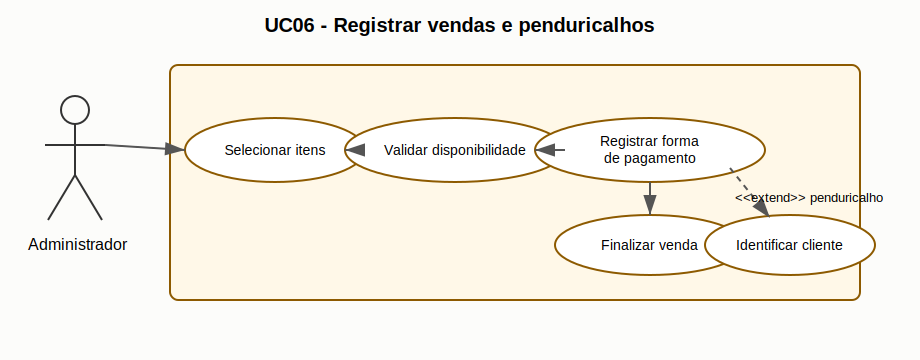

### UC07 - Checkout e pedidos
- Objetivo: permitir que o cliente conclua pedido e acompanhe status.
- Fluxo principal: montar carrinho, validar quantidade, confirmar checkout e consultar historico.
- Regra critica: quantidade do carrinho nao pode exceder estoque disponivel.
- No diagrama: aparece dentro da jornada do cliente, ligado ao ator Cliente, e inclui Validar Sessao e Validar Estoque para indicar que o pedido depende de usuario autenticado e disponibilidade dos produtos.

Codigo do diagrama: [UC07.puml](./UC_Codes/UC07.puml)

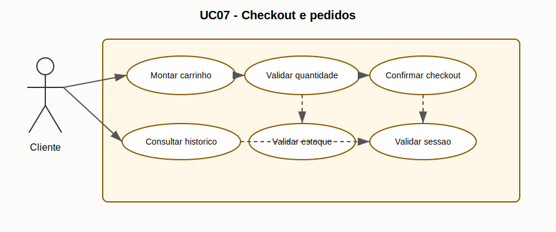

### UC08 - Operar offline e sincronizar
- Objetivo: manter operacao basica sem internet com reconciliacao posterior.
- Fluxo principal: gravar localmente, detectar reconexao e sincronizar em ordem cronologica.
- Regra critica: conflitos devem ser resolvidos com consistencia de dados.
- No diagrama: aparece em capacidades transversais e esta ligado ao ator Sistema, pois a sincronizacao offline/online e uma responsabilidade automatizada da plataforma; tambem inclui Sincronizar Eventos.

Codigo do diagrama: [UC08.puml](./UC_Codes/UC08.puml)

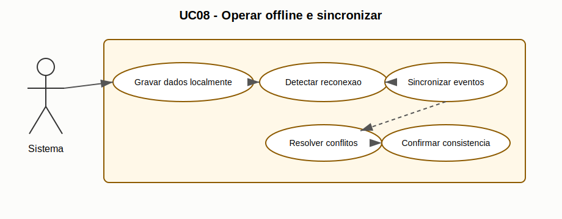

### UC09 - Administrar banners e destaques
- Objetivo: publicar campanhas visuais com controle de status ativo.
- Fluxo principal: cadastrar banner, definir ativo/inativo e refletir no app cliente.
- Regra critica: banner inativo nao deve aparecer como destaque principal.
- No diagrama: aparece dentro da jornada administrativa, ligado ao ator Administrador, e inclui Validar Sessao para garantir que apenas usuarios autorizados alterem destaques exibidos aos clientes.

Codigo do diagrama: [UC09.puml](./UC_Codes/UC09.puml)

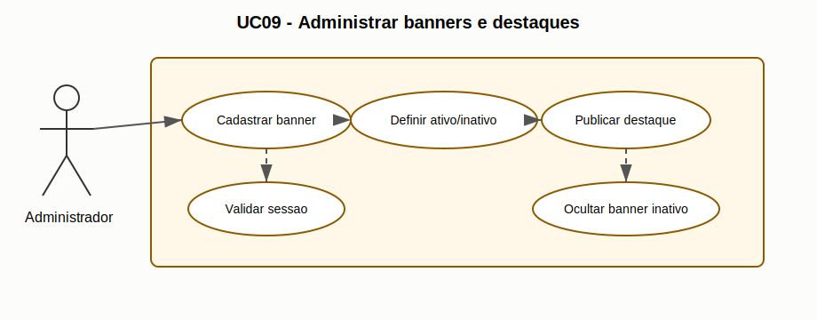

### UC10 - Consultar resumo e analytics
- Objetivo: apoiar decisao operacional com indicadores por periodo.
- Fluxo principal: selecionar periodo, carregar metricas e analisar desempenho.
- Regra critica: acesso restrito ao perfil administrativo.
- No diagrama: aparece dentro da jornada administrativa, ligado ao ator Administrador, inclui Validar Sessao e estende UC12 quando a analise pode acionar sugestoes de producao por IA.

Codigo do diagrama: [UC10.puml](./UC_Codes/UC10.puml)

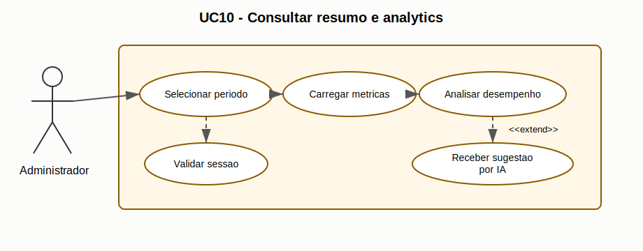

### UC11 - Receber atualizacoes por websocket
- Objetivo: refletir alteracoes de estoque/pedidos sem recarga manual.
- Fluxo principal: conectar socket, inscrever eventos e atualizar estado da interface.
- Regra critica: reconexao deve restaurar assinaturas de eventos.
- No diagrama: aparece em capacidades transversais e esta ligado ao ator Sistema, indicando que as atualizacoes em tempo real sao tratadas automaticamente; tambem inclui Sincronizar Eventos.

Codigo do diagrama: [UC11.puml](./UC_Codes/UC11.puml)

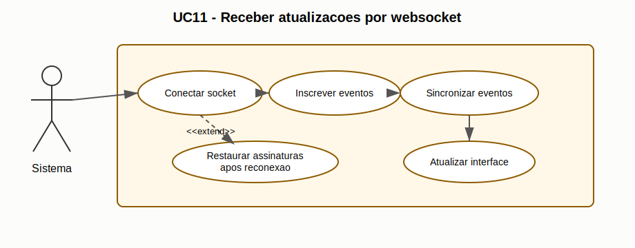

### UC12 - Receber sugestao de producao por IA
- Objetivo: sugerir volume de producao diario baseado em historico.
- Fluxo principal: consolidar dados, processar analise e exibir recomendacao.
- Regra critica: sugestao nao pode executar acao automatica sem confirmacao humana.
- No diagrama: aparece em capacidades transversais, ligado aos atores Administrador e IA, e pode ser acionado como extensao de UC10 para transformar indicadores historicos em recomendacao de producao.

Codigo do diagrama: [UC12.puml](./UC_Codes/UC12.puml)

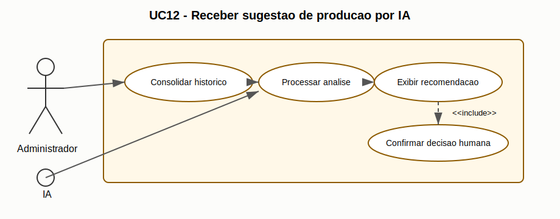

## Responsabilidades por Area

- Guilherme Portilho: lideranca tecnica e desenvolvimento full stack (frontend e backend).
- Vitoria Karolina: qualidade e validacao, com apoio na analise de requisitos.
- Gabrielly Cristina: apoio em documentacao e operacao.
- Leonardo Delfino Vieira: apoio tecnico e integracao.

## Relacao com a Documentacao

- Requisitos funcionais: [RF.md](../02-requisitos/RF.md)
- Regras de negocio: [RN.md](../02-requisitos/RN.md)
- Requisitos nao funcionais: [RNF.md](../02-requisitos/RNF.md)
- Organograma de responsabilidades: [organograma.md](../03-processo/organograma.md)
- Visao geral: [visao-geral.md](./visao-geral.md)

## Historico de Alteracoes

| Data | Versao | Alteracao | Responsavel |
|---|---|---|---|
| 2026-05-13 | 1.1.3 | Separacao dos codigos dos diagramas em UC_Codes e anexacao das imagens SVG de cada caso de uso no MVP. | Equipe L&J Doces |
| 2026-05-13 | 1.1.2 | Inclusao de um diagrama PlantUML individual abaixo de cada caso de uso do MVP. | Equipe L&J Doces |
| 2026-05-13 | 1.1.1 | Inclusao da explicacao de cada caso de uso conforme sua representacao no diagrama de casos de uso do MVP. | Equipe L&J Doces |
| 2026-05-12 | 1.1.0 | Atualizacao da matriz do MVP para cobrir RF-11 a RF-21 e alinhamento de responsabilidades com organograma 1.1.1. | Equipe L&J Doces |
| 2026-03-04 | 1.0.0 | Criacao inicial do documento de casos de uso do MVP. | Equipe L&J Doces |
